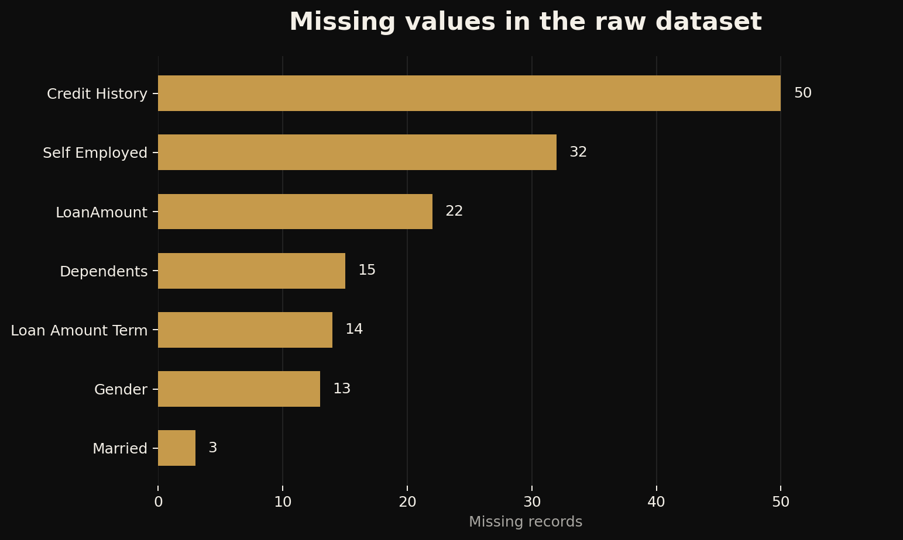
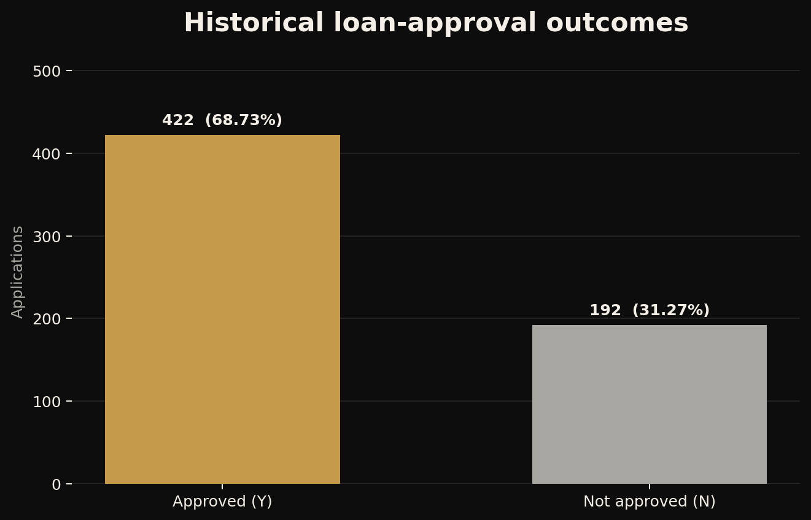

<p align="center">
  
</p>

<p align="center">
  <a href="https://www.linkedin.com/in/wilson-moses-9207b22bb">LinkedIn</a>
  ·
  <a href="https://github.com/WilsonMoses-Data">GitHub</a>
  ·
  <a href="https://www.tiktok.com/@moses.learnsdata">Moses Learns Data</a>
</p>

# Loan Approval Data Preparation

> A reproducible data-cleaning, feature-engineering and preprocessing project built from a 614-record loan-approval practice dataset.


## Project snapshot

| Project detail | Information |
|---|---|
| Domain | Financial analytics |
| Context | AnalystLab Africa Data Science Internship - Week 2 |
| Status | Completed data-preparation phase |
| Dataset | 614 applications and 13 original variables |
| Target | Historical `Loan_Status` (`Y` or `N`) |
| Core tools | Python, pandas, NumPy, Matplotlib, Seaborn and scikit-learn |
| Main outputs | Analysis notebook, cleaned data, numeric preprocessing artifact and two reports |

## Project overview

Machine-learning work is only as reliable as the data preparation behind it. This project examines a public loan-approval practice dataset, resolves missing values, creates analytical features, encodes categorical variables, assesses outliers and screens features for redundancy and initial relevance.

> **Goal:** Build a transparent preprocessing foundation for later loan-outcome modelling without claiming to produce a production lending system.

This repository documents an educational exercise. It must not be used to approve, reject or rank real applicants.

## Questions addressed

1. Which fields contain missing values, and how should they be treated?
2. Which identifiers or variables should not be used as ordinary predictors?
3. Which categorical variables require encoding?
4. Which numerical variables require standardisation for scale-sensitive methods?
5. Are apparent outliers plausible observations or obvious data errors?
6. Which engineered variables add useful analytical context?
7. Which features show redundancy or early association with the historical outcome?

## Dataset

The source contains one row per loan application.

| Measure | Value |
|---|---:|
| Applications | 614 |
| Original variables | 13 |
| Approved outcomes (`Y`) | 422 |
| Not-approved outcomes (`N`) | 192 |
| Approval proportion | 68.73% |
| Exact duplicate rows | 0 |
| Missing cells | 149 |
| Fields containing missing values | 7 |

See the [dataset documentation](data/README.md) for field definitions, provenance and processing notes.

## Initial data quality



| Field | Missing values | Treatment |
|---|---:|---|
| `Gender` | 13 | Mode |
| `Married` | 3 | Mode |
| `Dependents` | 15 | Mode |
| `Self_Employed` | 32 | Mode |
| `LoanAmount` | 22 | Median |
| `Loan_Amount_Term` | 14 | Mode |
| `Credit_History` | 50 | Mode |

Mode and median imputation are simple educational choices. In later predictive work, these decisions should be fitted on training data only and compared with alternatives.

## Preparation workflow

| Stage | Implementation |
|---|---|
| Inspection | Checked shape, types, summary statistics, missingness and duplicates |
| Cleaning | Applied documented mode and median imputation |
| Identifier handling | Removed `Loan_ID` from the analytical features |
| Feature engineering | Created `total_income` and `loan_income_ratio` |
| Naming | Converted fields to `snake_case` |
| Encoding | Applied binary, ordinal and one-hot encoding |
| Scaling | Standardised selected numerical fields |
| Outlier assessment | Used boxplots and the IQR rule; retained plausible extremes |
| Feature screening | Reviewed correlation, target relationships and exploratory Random Forest importance |
| Export | Produced cleaned analytical data and a numeric preprocessing artifact |

## Verified outputs

| File | Rows | Columns | Missing | Fully numeric | Purpose |
|---|---:|---:|---:|---|---|
| `loan_prediction_cleaned.csv` | 614 | 14 | 0 | No | Human-readable cleaned analytical dataset |
| `loan_prediction_ml_ready.csv` | 614 | 14 | 0 | Yes | Encoded and scaled full-sample preprocessing artifact |

The original repository accidentally exported the pre-encoding snapshot under the ML-ready filename. This version corrects the export so its contents now match its name and documentation.

## Selected findings



- Historical approvals represent 68.73% of the dataset, so accuracy alone would be an incomplete future evaluation metric.
- `credit_history` showed the strongest initial association with the historical outcome.
- Approval was recorded for approximately 79.58% of non-missing records with credit history `1`, compared with 7.87% for credit history `0`.
- `applicant_income` and engineered `total_income` had a correlation of approximately 0.89.
- Potential income and loan-value outliers were retained because they appeared plausible rather than clear data-entry errors.
- Random Forest importance was used only as exploratory screening; it does not establish causation or responsible lending relevance.

## Repository structure

```text
loan-approval-data-preparation/
├── .gitignore
├── LICENSE
├── README.md
├── requirements.txt
├── data/
│   ├── README.md
│   ├── raw/
│   │   └── loan_approval_train.csv
│   └── processed/
│       ├── loan_prediction_cleaned.csv
│       └── loan_prediction_ml_ready.csv
├── images/
│   ├── approval-outcomes.png
│   ├── feature-importance.png
│   ├── missing-values.png
│   ├── outlier-counts.png
│   ├── social-preview.png
│   ├── wilson-moses-logo.png
│   └── wilson-moses-banner.png
├── notebooks/
│   └── 01_loan_approval_data_preparation.ipynb
├── reports/
│   ├── business_understanding_report.pdf
│   └── data_preprocessing_report.pdf
└── scripts/
    ├── generate_readme_visuals.py
    ├── generate_reports.py
    └── prepare_data.py
```

## Run locally

```bash
git clone https://github.com/WilsonMoses-Data/loan-approval-data-preparation.git
cd loan-approval-data-preparation
python -m venv .venv
```

Activate the environment:

```bash
# Windows
.venv\Scripts\activate

# macOS or Linux
source .venv/bin/activate
```

Install the dependencies:

```bash
python -m pip install --upgrade pip
pip install -r requirements.txt
```

Reproduce the processed datasets and README visuals:

```bash
python scripts/prepare_data.py
python scripts/generate_readme_visuals.py
python scripts/generate_reports.py
jupyter lab notebooks/01_loan_approval_data_preparation.ipynb
```

## Reports

- [Business Understanding Report](reports/business_understanding_report.pdf)
- [Data Preprocessing Report](reports/data_preprocessing_report.pdf)

The reports use the current Wilson Moses visual identity and omit private phone and email details.

## Limitations and responsible use

- The dataset is small and intended for practice, not real lending operations.
- Historical approval labels may reflect undocumented policy choices or bias.
- Gender, marital status and other personal characteristics require legal, ethical and fairness review before any real use.
- Mode imputation can reinforce majority categories and reduce variation.
- `loan_income_ratio` is only a rough proxy and omits interest rates, expenses, debt and repayment capacity.
- The published numeric file was scaled on the full sample as part of this preprocessing exercise. For unbiased model evaluation, split first and fit every transformation on training data only.
- Feature importance and correlation describe associations, not causes.
- No production model, deployment, credit policy or real-world performance is claimed.

## Skills demonstrated

- Data inspection and quality assessment
- Missing-value treatment
- Feature engineering and naming standardisation
- Categorical encoding and numerical scaling
- Outlier assessment
- Correlation and exploratory feature screening
- Reproducible Python workflow design
- Responsible interpretation and technical reporting

## Learning reflection

This project reinforced that preprocessing is not a mechanical checklist. Each transformation changes what a later model can learn, so the reasoning, timing and limitations of every decision must be documented.

## Next steps

- Rebuild preprocessing as a scikit-learn `Pipeline` and `ColumnTransformer`.
- Split the data before fitting imputers, encoders, scalers and feature-selection decisions.
- Establish a transparent baseline and evaluate class-sensitive metrics.
- Examine calibration, subgroup errors and fairness risks.
- Consolidate compatible work with the later advanced-analysis phase without duplicating artifacts.

## Author

**Wilson Moses**  
Developing Data Scientist × AI Engineer based in Botswana

[LinkedIn](https://www.linkedin.com/in/wilson-moses-9207b22bb) · [GitHub](https://github.com/WilsonMoses-Data) · [Moses Learns Data](https://www.tiktok.com/@moses.learnsdata)

---

<p align="center"><strong>Learning. Building. Applying.</strong></p>
